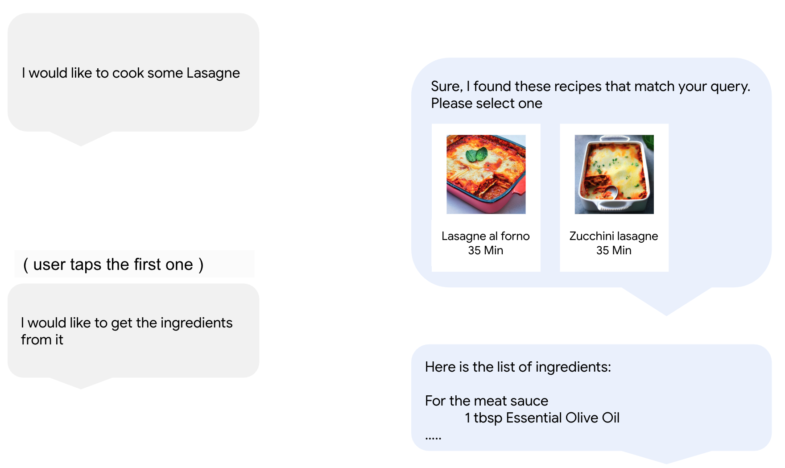
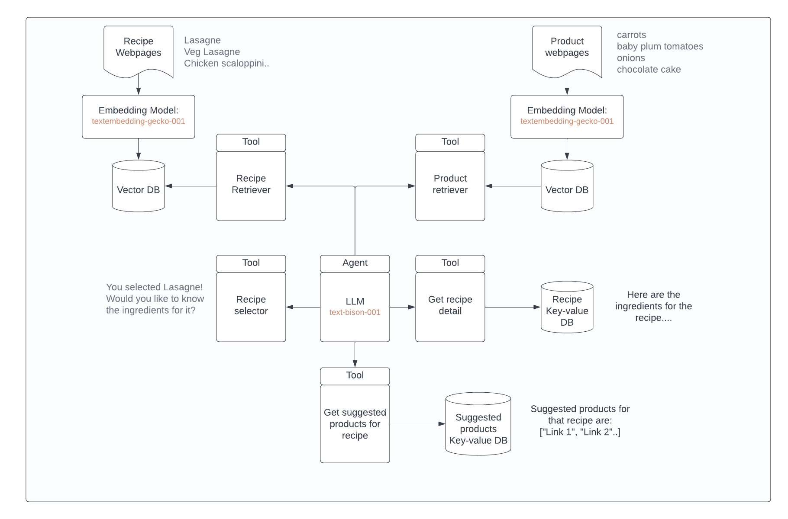

# About Grocery-bot

GroceryBot is your friendly grocery shopping assistant, created to make your Grocery shopping experience even better. Using advanced tech like Retrieval Augmented Generation (RAG) and Reasoning + Acting (ReAct), GroceryBot can suggest recipes, provide detailed ingredient lists, and offer cooking instructions. It also recommends products straight from Grocery’s catalog. By basing its advice on real recipes and products, GroceryBot ensures you get accurate and useful help, making it easier to find everything you need for your meals. Plus, it can be seamlessly integrated into a front-end application for a smooth and interactive shopping journey.

## Scenario
Imagine you are a user of Grocery store. You would like to cook something nice for dinner, like lasagne, but you don't know where to start, which ingredients to buy, or how to cook lasagne.

You enter the website and you find that Grocery store has just released a new conversational bot, GroceryBot!

GroceryBot will help you in your shopping journey by:

1. Suggesting you a recipe
2. Getting the list of ingredients and cooking instructions
3. Suggesting you products you will like to buy for that recipe
4. Helping you find new products you'd like to buy for your dinner!

## Objective & Requirements
Your objective is to develop GroceryBot!

There is one main requirement: you will need to make sure that this bot is grounded. Grounding refers to the process of connecting LLMs with external knowledge sources, such as databases.

In practice, this means that GroceryBot should leverage:

The existing recipe catalog of Grocery store. GroceryBot should not suggest recipes that are not part of this catalog.
The existing product catalog of Grocery store. GroceryBot should not suggest products that are not part of this catalog.
A set of precomputed products suggested for a recipe.
To do this, you can use an approach called Retrieval Augmented Generation (RAG), which attempts to mitigate the problem of hallucination by inserting factual information (in this case, recipe and product information) into the prompt which is sent to the LLM.

The following image shows what could be possible with GroceryBot if the solution was to be deployed and integrated with a FrontEnd application.

## Key Features:
Recipe Suggestions: Recommends recipes from Grocery's existing catalog.
Ingredient Lists and Instructions: Provides detailed ingredient lists and cooking instructions for selected recipes.
Product Recommendations: Suggests products from Grocery's catalog to purchase for the chosen recipes.
Personalized Shopping Assistance: Helps users discover new products they might like for their meals.

Usage:
Clone the repository.
Install dependencies from requirements.txt.
Run the Jupyter notebook and change the inputs to interact with GroceryBot.

Alternatively, the model can be accessed via command prompt. To do that, just go to the python folder using cmd and then run command python grocerybot_assistant.py

## Potential Integration:
The project can be integrated into a front-end application, enhancing user experience on the Grocery website.

## Contribution and Licensing:
Contributions are welcome, and the project is licensed under the MIT License.